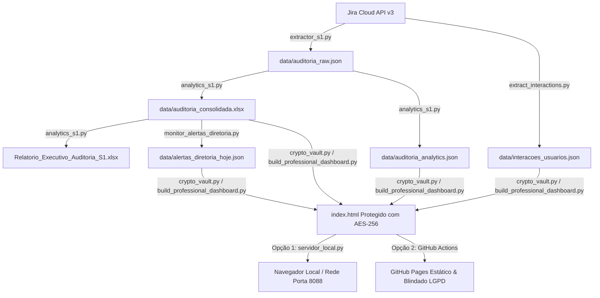

# Arquitetura do Sistema de Auditoria Jira S1 Saúde

Documento de especificação técnica e arquitetura de dados do projeto **S1-JIRA-ANALISE-AUDITORIA**.

---

## 🏗️ Visão Geral da Arquitetura

O sistema opera no modelo **Extract, Transform, Analyze, Encrypt & Present (ETAP)** em pipeline autônomo local e nuvem (GitHub Actions / Pages):

---

## 🔄 Fluxo de Dados e Componentes

### 1. Camada de Extração (`scripts/extractor_s1.py` & `scripts/extract_interactions.py`)
- **Conexão:** Autenticação HTTP Basic com Token Jira Cloud via variáveis de ambiente (`JIRA_API_TOKEN`, `JIRA_USER_EMAIL`).
- **JQL de Extração:** `project = 'AUDITORIA' ORDER BY created DESC`.
- **Paginação:** Utilização do cursor `nextPageToken` para coleta incremental completa.
- **Campos Customizados Mapeados:**
  - `customfield_10091` / `customfield_10092`: Análise CPT (Cobertura Parcial Temporária).
  - `customfield_10093` / `customfield_10094`: Acompanhamento APS.
  - `customfield_10096`: Tipo de Beneficiário (Titular / Dependente).
  - `customfield_10098`: Caminho da pasta de arquivos (ex: Z:\).
- **Changelogs:** Extração do histórico de movimentações para avaliar transições operacionais da equipe.

### 2. Camada de Processamento Analítico (`scripts/analytics_s1.py`)
- Separação entre chamados principais (Lotes) e subtarefas (Vidas individuais).
- Cálculo de KPIs consolidados: Taxa de Liberação, Vidas Pendentes, Vidas Concluídas, Volume por Vigência.
- Geração da planilha executiva multi-aba `Relatorio_Executivo_Auditoria_S1.xlsx`.

### 3. Camada de Monitoramento e Alertas (`scripts/monitor_alertas_diretoria.py`)
- Identificação precisa da **última data de transição** para os status críticos:
  - Casos com status `AGUARDANDO DIRETORIA`.
  - Casos com status `PENDÊNCIA CADASTRO`.
  - Lotes em `ANÁLISE PENDENTE` com vigências iminentes (meses correntes).
- Cálculo em tempo real dos dias de espera desde a última ocorrência da pendência.

### 4. Camada de Blindagem e Criptografia LGPD (`scripts/crypto_vault.py`)
- **Algoritmo:** AES-256-GCM com derivação de chave por PBKDF2 (100.000 iterações com Salt e SHA-256).
- **Mecanismo:** Geração de Chave Mestra para o payload de dados e envelopamento (*Key Wrapping*) para os usuários corporativos autorizados (`marcelo.guedes`, `priscila.tada`, `diretoria`, `auditoria.s1`).
- **Segurança em Repouso:** Os arquivos hospedados no GitHub Pages não possuem dados de pacientes em texto claro. A descriptografia ocorre exclusivamente na memória RAM do navegador após autenticação bem-sucedida.

### 5. Camada de Apresentação (`scripts/build_professional_dashboard.py`)
- Tela de login corporativa com identidade visual da S1 Saúde.
- Descriptografia client-side ultra-rápida via Web Crypto API (`window.crypto.subtle`).
- Gráficos interativos renderizados via Chart.js v4 com paleta oficial da S1 Saúde.
- Gestão de sessão em `sessionStorage` com suporte a Logout seguro.

### 6. Automação e Deploy no GitHub Pages (`.github/workflows/deploy_pages.yml`)
- **Agendamento Cron:** Segunda a Sexta-feira, das 08h às 18h, de 4 em 4 horas (08:00, 12:00, 16:00 Horário de Brasília / `0 11,15,19 * * 1-5` UTC).
- **Disparo Manual:** Opção `workflow_dispatch` para atualização instantânea a qualquer momento via interface do GitHub.
- **Gestão de Segredos:** Tokens e credenciais isolados em GitHub Secrets (`JIRA_API_TOKEN`, `JIRA_USER_EMAIL`, etc.), permitindo renovação anual sem alteração de código-fonte.
